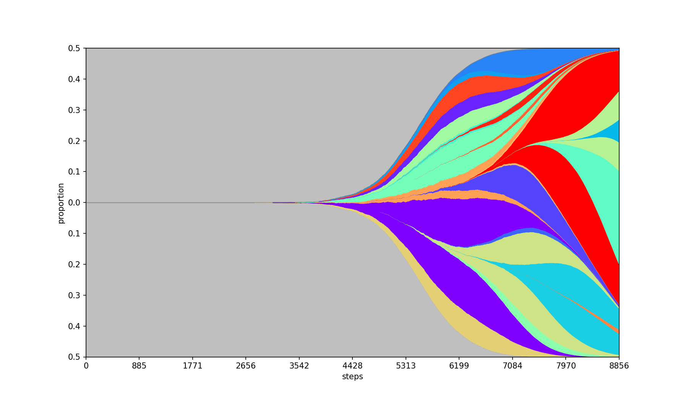
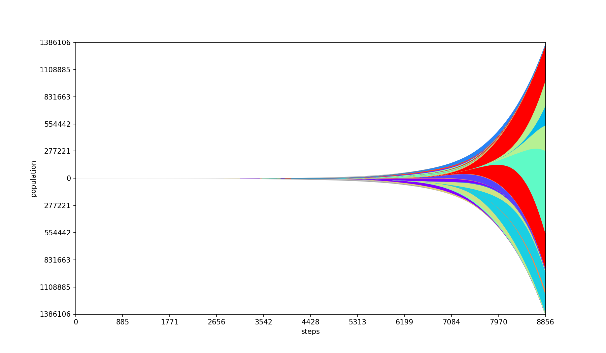
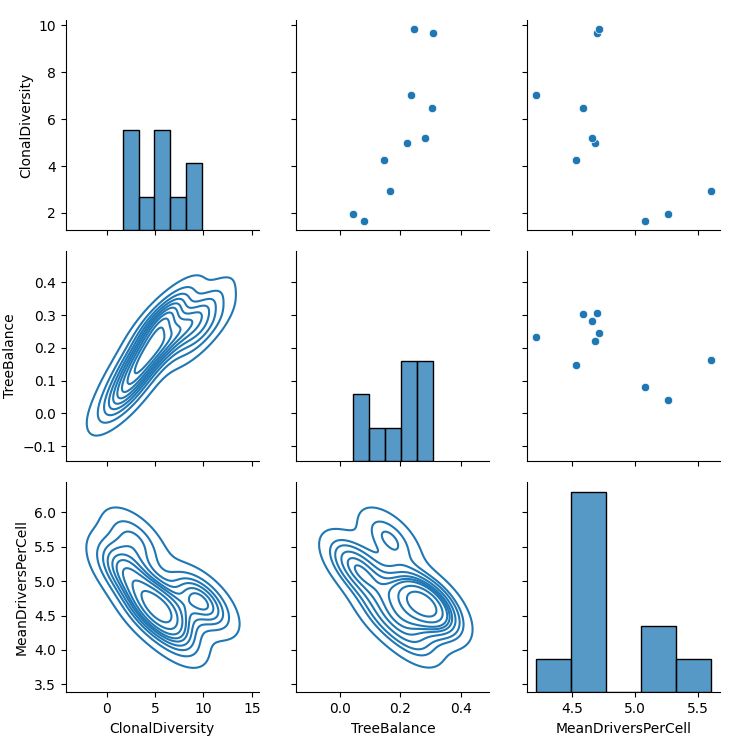
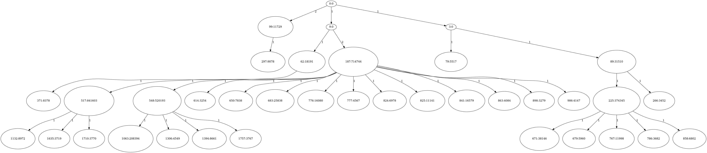

# SMITH 2022: Stochastic Model of Intra-Tumor Heterogeneity (Article Version)

SMITH is a tool for fast stochastic simulation of evolution of subclones within a solid tumor. 

We use a confined, well-mixed, branching model of cell populations.

The tool runs large-scale simulations (typically ~billion, but larger orders are also possible) and allows for fast evaluation across multiple executions.

## Requirements

### TL;DR; 

The program can be run on a platform of your choice in the provided *Conda* environment. Inside of the repo run `conda env create --file SMITH.yml`. 

### Tested platforms

The program has been tested on:
* Windows 10 - PowerShell
* Windows 10 - WSL2 Ubuntu
* Ubuntu 20
* MacOS X 10 

### Simulation

The simulation code is written in **C# 8**. **.NET 5.0** or newer is requred. We recommend installation using *Conda*:
```
conda install -c conda-forge dotnet
``` 

### Data analysis

The analysis code is written in **Python 3.8**. The following packages are required (either from *Conda* or *Pip*):
```
conda install -c bioconda pyfish
conda install -c conda-forge biopython matplotlib numpy pandas seaborn pillow
```

## Execution

The default execution is:
```
git clone git@bitbucket.org:schwarzlab/smith.git
cd smith
dotnet run
./plots.sh
```

The results will be written to the folder `./out`

#### Options

Use `dotnet run -- [options]` to specify any of the following:

```
  -O, --output    (Default: ./out) The path to the output files.
  -C, --config    (Default: ) A json file with configuration of the experiment.
  -N              (Default: false) Use newline in logs (useful for batch execution)
```

#### Test

A test set with minimum simulation is provided. The test is conducted by output comparison. Run:

```
./plots.sh
```


## Output

The following output was generated using the [demo configuration](./doc/doc_config.json). 

To reproduce the results run `dotnet run -- -C ./doc/doc_config.json`.

The text files are primariliy used as source for plots shown below.

#### `parent_tree.csv` 

Describes the parent-child relationship between subclones. Used for plotting of Fish Plots. For details see [PyFish repository](https://bitbucket.org/schwarzlab/pyfish/).

#### `populations.csv`

Lists population sizes at individual timepoints for each subclone.  Used for plotting of Fish Plots.  For details see [PyFish repository](https://bitbucket.org/schwarzlab/pyfish/).

#### `summary.csv`     

Statistical / analytical eveluation of the simulation at individual stops. If checkpoints are used, log2 sizes are considered as stops, starting from the minimum size. Otherwise only one output at the end of the simulation is printed.

#### `parent_graph.dot`

An evolutionary tree with mutation distances and population sizes between the individual subclones. The graph is written in the [DOT language](https://graphviz.org/doc/info/lang.html).

#### `sim_params.json` 

Stores configuration parameters used for this simulation, including the random seed. If this file is provided on input, the exact same simulation will be executed.

#### `subclones.out`  

Information about the individual subclones at the end of the simulation.

***

### Created by ./plots.sh

#### `fish.png`, `fish_abs.png`  
Fish plots generated using the [PyFish package](https://bitbucket.org/schwarzlab/pyfish): 

| relative plot (population sizes compared to each other) | absolute plot (population sizes compared to the final sample) |
|---------------------------------------------------------|---------------------------------------------------------------|
|                               |                                 |

#### `metrics_relationships.png`
Plot the pairwise relationship between every pair of metrics present in `summary.csv` as well as their indiviudal distributions. This is usually used in the initial assesment of the simulation as a quick overview of the values produced.



#### `parent_graph.png` 
An evolutionary tree describing the individual sampled clones and their total population (labelled nodes), together with their evolutionary distance from the parent (labelled edges).



## Contact
Email questions, feature requests and bug reports to Adam Streck, adam.streck@mdc-berlin.de.

## License
SMITH is available under the MIT License.