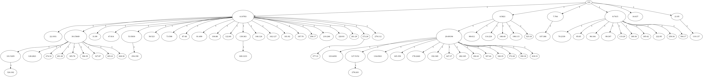

# SMITH: Stochastic Model of Intra-Tumor Heterogeneity

SMITH is a tool for fast stochastic simulation of evolution of subclones within a solid tumor. 

We use a confined, well-mixed, branching model of cell populations.

The tool runs large-scale simulations (typically ~billion, but larger orders are also possible with the limitation of 2^31 per clone) and allows for fast evaluation across multiple executions.

## Requirements

### TL;DR; 

The program can be run on a platform of your choice in the provided *Conda* environment. Inside of the repo run 
```
conda env create --file SMITH.yml
conda activate smith
```

### Tested platforms

The program has been tested on:
* Windows 10 - PowerShell
* Windows 10 - WSL2 Ubuntu
* Ubuntu 20
* MacOS X 10 

### Simulation

The simulation code is written in **C#**. **.NET 10** is required. We recommend installation using *Conda*:
```
conda install -c conda-forge "dotnet>=10,<11"
``` 

### Data analysis

The analysis code is written in **Python 3.8**. The following packages are required (either from *Conda* or *Pip*):
```
conda install -c bioconda pyfish
conda install -c conda-forge biopython matplotlib numpy pandas seaborn pillow
```

## Execution

The default execution is:
```
git clone git@github.com:schwarzlab-ccb/SMITH.git
cd SMITH
dotnet run
./plot.sh
```

The results will be written to the folder `./out`

### Options

Use `dotnet run -- [options]` to specify any of the following:

```
  -O, --output    (Default: ./out) The path to the output files.
  -C, --config    (Default: ./sim_params.json) A json file with configuration of the experiment.
  -N              (Default: false) Use newline in logs (useful for batch execution)
```

### Cancer-type configs

The `configs/` folder holds ready-made parameter sets for the cancer types modelled in
[Streck et al. 2023](https://academic.oup.com/bioinformatics/article/39/3/btad102/7056642). Each
type has a bulk (`*_bulk.json`) and a single-cell (`*_SC.json`) variant; the two variants differ in
sampling-related parameters, while the cancer types differ from one another **only** in the global
and local confinement fit in the paper:

| Config | Cancer type (data) | `ConfGlobal` | `ConfLocal` |
|---|---|---|---|
| `AML_*`    | AML (single-cell DNA)         | 0   | 0     |
| `RCC_*`    | Kidney / renal cell carcinoma (multi-region WES) | 0.5 | 0 |
| `MESO_*`   | Mesothelioma (multi-region WES) | 0.5 | 0   |
| `BRCA_*`   | Breast (single-cell RNA)      | 0.5 | 0.125 |
| `LUAD_*`   | Lung adenocarcinoma (multi-region WES) | 0.5 | 0.125 |
| `UVM_*`    | Uveal melanoma (single-cell RNA) | 2 | 0.125 |

Run a single config, e.g.:
```
dotnet run -- -C ./configs/UVM_bulk.json -O ./out/UVM_bulk
./plot.sh ./out/UVM_bulk
```

### Batch execution (SLURM)

`run_smith.sbatch` runs a single config as a SLURM job; `run_smith_array.sbatch` is a job array that
runs every config under `configs/` (one array task each, output to `out/<config-name>/`). Both
activate the `smith` conda env and call the pre-built Release binary, writing logs to the (gitignored)
`logs/` folder. Submit with:
```
sbatch run_smith_array.sbatch      # keep --array=0-(N-1) in sync with the number of configs
```
`run_smith_array.sbatch` and `logs/` are gitignored (local run artifacts).

## Parameters

The following parameter values can be set in the configuration file:

### Simulation options    

For the fitness types a numerical value can be also used, e.g. `"FitnessAcc": 1` is equivalent to `"FitnessAcc": "Add"`.

 * `FitnessAcc: ["Mul", "Add", "Lim"]` The fitness accumulation across all mutations. Either multiplicative (0), additive (1), or asymptotically limited with the max value of 10 (2).
 * `FitnessDist: ["Constant", "Normal", "Exponential", "Uniform"]` The fitness of a mutation is sampled from a distribution. Either constant (0), normal (1), exponential (2), or uniform (3).
 * `FitnessEffect: ["Birth", "Death", "Both"]` The effect of mutation on the fitness of the clone. Either birth (0), death (1), or both (2).
 * `Seed: int` The random seed for the simulation.

### Model
* `Turnover: [0.0-1.0]`  The fraction of cells dividing per step (should be considerably smaller than 1).
* `MutationProb: [0.0-1.0]` The probability of a driver mutation per new cell.
* `FitnessMean: unsigned double` The mean fitness increase per mutation.
* `ConfGlobal: unsigned double` The global confinement of the population - the higher the confinement the stronger the competition between clones.
* `ConfLocal: unsigned double` The local confinement of the population - the higher the confinement the stronger the restriction of the population of each clone.

### Initialization
* `StartMut: uint` The number of mutation of the cells in the first clone at the start.
* `StartPop: uint` The number of cells in the the first clone at the start.

### Control variables
* `MinPop: uint` The simulation resets if the population dies out before reaching this number.
* `MaxPop: uint` The simulation stops at (or after) this population.
* `MaxSteps: int` The simulation stops at this step. `-1` means no limit.
* `MaxClones: int` The simulation stops at this number of clones. `-1` means no limit.
* `MaxTries: int` The simulation stops if it fails to finish after this number of tries. `-1` means no limit.
* `Reps: uint` How many times the simulation runs.

### Output
* `CutOff: [0.0-1.0]` Only the clones that have at least this fraction of the alive population (e.g. `.01` means at least one percent of alive cells) are included in the output. 
* `CloneSample: int` The number of clones to sample from the population, the clones are sorted by size in descending order, then first `CloneSample` clones are selected. This is ingored if the value is negative.
* `CalcFish: bool` Will include data for Fish Plots in the output. These are not calculated by default as it is storage-intensive.
* `FishFrac: [0.0-1.0]` Similar to `CutOff`, but used for Fish Plots. Unline with `CutOff` a population is included in the output if the fraction has been attained at any step throughout the simulation.


## Test

Automated tests are available via `dotnet test`:

```
dotnet test tests/SMITH.Tests.csproj
```

The legacy file-diff script is still available:

```
./tests/test.sh
```

## Plot

Use `./plot.sh <out>` for both non-repeated and repeated experiments.

* The target folder must contain `summary.csv` and `sim_params.json`.
* If `<out>` has direct output files (`populations.csv` and `parent_tree.csv`), only that folder is plotted.
* Otherwise, the script recursively traverses child folders and plots every folder that contains direct output files.
* If `<out>` is omitted, the default output folder `./out` is used.

`./multiplot.sh <out>` is kept as a compatibility wrapper and forwards to `./plot.sh <out>`.

## Output

The following output was generated using the [demo configuration](./doc/doc_config.json). 

To reproduce the results run `dotnet run -- -C ./doc/doc_config.json`.

The text files are primariliy used as source for plots shown below.


#### `parent_tree.csv` 

Describes the parent-child relationship between subclones. Used for plotting of Fish Plots. For details see [PyFish repository](https://bitbucket.org/schwarzlab/pyfish/).

#### `populations.csv`

Lists population sizes at individual timepoints for each subclone.  Used for plotting of Fish Plots.  For details see [PyFish repository](https://bitbucket.org/schwarzlab/pyfish/).

#### `summary.csv`     

Statistical / analytical eveluation of the simulation at individual stops. If checkpoints are used, log2 sizes are considered as stops, starting from the minimum size. Otherwise only one output at the end of the simulation is printed.

Columns:

* RepeatId: 0-indexed number of repetitions with different seeds, if the first run did not go through.
* GenerationId: 0-indexed of the current line
* Generations: 0-indexed number of generations (steps) that occured prior to this line
* Time: hour:minute:second.milliseconds
* SubcloneSelect: How many clones are output (above cutoff)
* SubcloneAlive: How many clones had at least 1 alive cell
* SubcloneTotal: How many clones exist in total
* CellSelectCount: How many cells are in the output clones
* CellAliveCount: How many cells are alive in total
* CellNecroCount: How many necrotic cells are in total
* CellTumorCount: Alive+necrotic cells
* CellLostCount: How many cells were lost (no longer part of tumour mass)
* CellTotalCount: Alive+necrotic+lost cells
* MeanDriversPerCell: Average number of drivers per alive cell in the select clones.
* ClonalDiversity: The clonal diversity of the select clones (see https://doi.org/10.1093/bioinformatics/btad102)
* TreeBalance: For the clone tree from select clones (see clone_tree.png below) its tree ballance
* TreeDepth: For the clone tree, its depth
* NodeCount: For the clone tree, its number of nodes (incl. root)
* LeafCount: For the clone tree, its number of leafs
* Branching: For the clone tree, its branching = (NodeCount - 1) / LeafCount 


#### `clone_tree.dot`

An evolutionary tree with mutation distances and population sizes between the individual subclones. The graph is written in the [DOT format](https://graphviz.org/doc/info/lang.html).
Node labels are written as `[cloneid]-[population_size]`.

#### `clone_tree.new`

A logical-time clone tree in [Newick format](https://en.wikipedia.org/wiki/Newick_format).
Branch lengths are simulation steps, so the horizontal coordinate is the absolute appearance
step. At each branching step, the parent clone has one child for its own continuing lineage and
one child for each subclone appearing at that step. Its node label is
`[cloneid]-[population_size]`, using the parent's cell count at that step. Events at different
steps therefore remain bifurcating; a multifurcation is emitted only when multiple subclones
appear from the same parent in the same step. Terminal labels use the population size at the end
of the simulation.

#### `sim_params.json` 

Stores configuration parameters used for this simulation, including the random seed. If this file is provided on input, the exact same simulation will be executed.

#### `clones.csv`  

Information about the individual subclones at the end of the simulation.

### Plots

#### `fish.png`, `fish_abs.png`  
Fish plots generated using the [PyFish package](https://bitbucket.org/schwarzlab/pyfish): 

| relative plot (population sizes compared to each other) | absolute plot (population sizes compared to the final sample) |
|---------------------------------------------------------|---------------------------------------------------------------|
|                               |                                 |

#### `clone_tree.png` 
An evolutionary tree describing the individual sampled clones and their total population (labelled nodes), together with their evolutionary distance from the parent (labelled edges).



#### `phylogenetic_tree.png`
The `clone_tree.new` logical-time tree rendered with Biopython's `Bio.Phylo`. Branching and
terminal nodes are labelled with `cloneid-population_size`, and the horizontal axis shows the
simulation step.

## Figures for Streck et al. 2023
The main and supplementary figures for the 2023 publication (Streck, Kaufmann, and Schwarz) are created using the notebooks in the `article_figures` directory.

Most plotting data is provided in `article_figures/data` and was created from raw data using `article_figures/scripts/create_plotting_data_from_raw.py`.

The exception are the plotting data for the fish plots and individual trajectories which were excluded due to size restrictions (>100MB). The raw fish data for these simulation runs can be generated using the smith config files found in `smith/article_figures/data/fish_plot_configs` and `smith/article_figures/data/trajectories_configs`.

### Nextflow simulation workflow (`article_figures/main.nf`)

The workflow is invoked via `nextflow run article_figures` and drives all simulation steps needed for the article. It exposes two named sub-workflows selected with the `--only` flag:

| `--only` value | Workflow | Description |
|---|---|---|
| `fish` | `REPRESENTATIVE_RUNS` | Runs the fish-plot configs from `data/fish_plot_configs/` |
| `trajectories` | `REPRESENTATIVE_RUNS` | Runs the trajectory configs from `data/trajectories_configs/` |
| `all` *(default)* | `REPRESENTATIVE_RUNS` | Runs both `fish` and `trajectories` |
| `grid` | `PARAMETER_GRID_SEARCH` | Runs the confinement parameter grid search |

**`REPRESENTATIVE_RUNS`** reads pre-existing `*_sim_params.json` config files from the two data directories and launches one simulation task per file. Results land in `<results_dir>/parameter_range_<stub>/`.

**`PARAMETER_GRID_SEARCH`** implements the fitting procedure from Section 2.9 of Streck et al. 2023. It sweeps all 36 combinations of global and local confinement (`hconf, hlocal ∈ {0, 0.125, 0.25, 0.5, 1, 2}`) with 100 stochastic replicates each (3 600 tasks total). Configs are generated inline with fixed defaults from the paper (`MutationProb = 2×10⁻⁵`, `FitnessMean = 0.1`, `FitnessDist = Exponential`). Results land in `<results_dir>/grid_search_<hconf>_<hlocal>_<rep>/`. Fish-plot output is disabled for the grid runs since only `MeanDriversPerCell` and `ClonalDiversity` from `summary.csv` are needed for model fitting.

Both workflows skip tasks whose output directory already contains the expected output files, so re-runs are safe and incremental.

**Common flags:**

```bash
nextflow run article_figures \
  --only grid \
  --results_dir /path/to/out/results \
  --max_forks 8 \
  --conda_env /path/to/SMITH.yml
```

`results_dir` defaults to `out/results`, `max_forks` defaults to the available CPU count, and
`conda_env` defaults to the repository's `SMITH.yml`.

The institutional SLURM defaults can be overridden with
`--slurm_options '<sbatch options>'` when using the `slurm` profile.

### Recreate article figures from repo root (bash)

Run the following commands from the repository root:

```bash
# 1) Activate environment
conda activate smith

# 2) Ensure required packages are installed (R core + Biopython)
conda install -c conda-forge r-base biopython

# 3) Build simulation binary
dotnet build SMITH.sln -c Release

# 4) Fetch Noble et al. 2022 source data next to this repo (../ModesOfEvolution)
git clone https://github.com/robjohnnoble/ModesOfEvolution ../ModesOfEvolution

# 5) Build real_data.csv used by the article notebook inputs
Rscript article_figures/scripts/combine_real_data.R

# 6) Run missing simulations (fish plots + trajectories)
#    (results are written to article_figures/out/results)
nextflow run article_figures --results_dir article_figures/out/results

# 7) Rebuild article_figures/data/*.pkl from the raw simulation output
#    (required after step 6 if you want to regenerate the pkl files;
#     skip if the pre-computed pkl files already in the repo are sufficient)
STRECK_RESULTS_DIR=article_figures/out/results python article_figures/scripts/create_plotting_data_from_raw.py

# 8) Execute notebooks to regenerate figures
jupyter nbconvert --to notebook --execute article_figures/plots_methods.ipynb --output plots_methods.executed.ipynb
jupyter nbconvert --to notebook --execute article_figures/create_figures.ipynb --output create_figures.executed.ipynb
```

Figure outputs are written by the notebook workflow into the `article_figures/figures` and `article_figures/final_figures` folders.

**Noble et al. 2022:**
Raw data was taken from [the Noble et al. 2022 GitHub repository](https://github.com/robjohnnoble/ModesOfEvolution).
To create the `real_data.csv` run the script `smith/article_figures/scripts/combine_real_data.R`. Note that you have to see the variable `NOBLE_REPO_DIR` at the top of the script

## Citation
Please cite as: *Adam Streck, Tom L Kaufmann, Roland F Schwarz, SMITH: Spatially Constrained Stochastic Model for Simulation of Intra-Tumour Heterogeneity, Bioinformatics, 2023; https://doi.org/10.1093/bioinformatics/btad102*

## Contact
Email questions, feature requests and bug reports to Adam Streck, adam.streck@mdc-berlin.de.

## License
SMITH is available under the MIT License.
